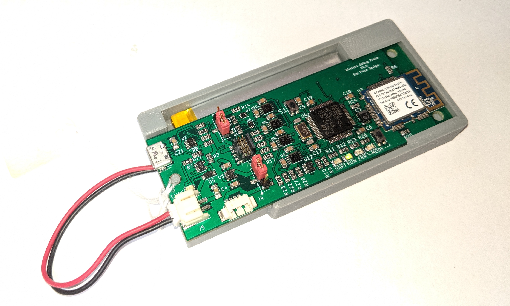
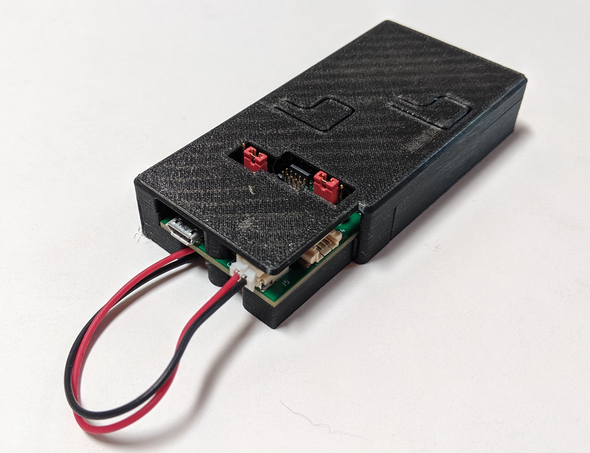

# 3D Printable Cases for the ctxLink

This directory has designs for two 3D printable cases that hold the
ctxLink and its battery.

Both cases were modeled in AutoDesk Fusion 360.  Both Fusion 360 design files and STL files are here.

The Fusion 360 design files have a `.f3z` extension,

## Open Top Case

This case is open on top.  It allows unobstructed access to all the
components.

There are two versions of this case, "loose" and "snug".  Depending
on your printer and the PCB's manufacturing tolerances, your ctxLink
board may not fit in the snug case.  The loose case adds 0.2mm of
clearance on every side of the PCB.

If neither fits, you can edit the Fusion 360 file and adjust the
`case_pcb_clearance` user parameter.  Snug uses 0.0mm clearance;
loose uses 0.2mm.

## Two Piece Case

This case has two halves that snap together.  It has cutouts for the jumpers and the JTAG cable, thin spots above the LEDs, and molded
plastic contacts for the buttons.

If your printing workflow can do color changes, I suggest printing
the first two layers of the lid in a transparent PLA, and the rest
in an opaque color.  If not, print the whole lid in transparent.

N.B., Fusion 360 gave errors just before I exported the `.f3z` file.
The file may not be complete.  If I can determine what's going on,
I will update the file here.
