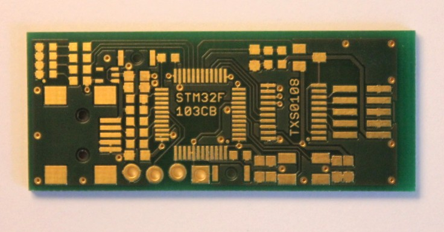
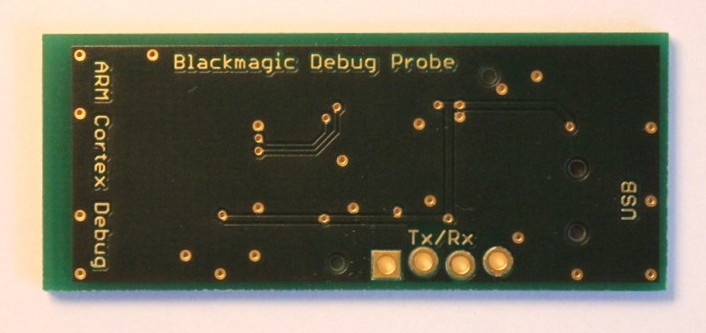
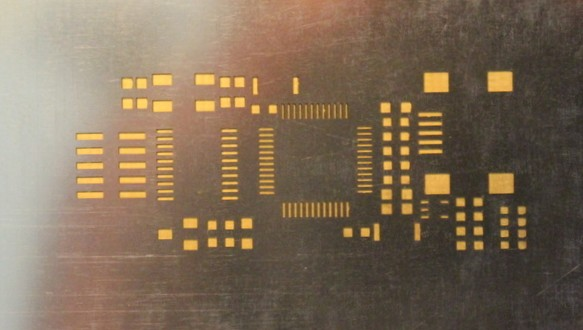

This variant attempts to be as faithful to the Blackmagic mini as
possible, but also has several differences. This board has been built
and functions.

## Details

* The schematic and board have both been designed using Cadsoft EAGLE
  v6.4.0.

* The board size is 40mm x 16mm.

* The programming connector is an ARM 10-PIN Interface as described
  [here](http://www.keil.com/support/man/docs/ulink2/ulink2_hw_connectors.htm).

## Differences

### Uses 0603 [1608 Metric] components

The layout is intended for reflow soldering.

### Includes Level Translator

This board incorporates the same level translator used in the
full-sized Blackmagic, so it can be used to safely program 2.7V or
1.8V systems.

### USART Connector

The STM32F103's USART1 peripheral is broken out into a 0.1"
header. The hole centres are
[slightly offset to allow a press-fit](https://www.sparkfun.com/tutorials/114).

### BOOT0 Button

As well as the standard button for entering USB DFU mode, this variant
also provides a button for pulling the BOOT0 pin high to activate the
STM32 SystemMemory bootloader. Hold this button when plugging in the
module to enter then bootloader mode. Then
[scripts/bootprog.py](scripts/bootprog.py) can be used to program and
reprogram the chip over the USART1 interface.

This is useful for programming a brand new or 'bricked' blackmagic
with the DFU firmware (src/blackmagic_dfu.bin), the standard DFU mode
should be used for regular firmware updates.

## Parts and Costings

* [Parts List](Parts.md)

Parts Cost (Approximate): £14 + VAT
([uk.farnell.com](http://uk.farnell.com) August 2013)

Programming Cable: £8.49 + VAT
([uk.farnell.com](http://uk.farnell.com/samtec/ffsd-05-d-06-00-01-n/ribbon-cable-idc-152-4mm-grey-10way/dp/1667659)
August 2013)

## Assembly Photos

### Blank PCB:

### Solder Paste Stencil:

